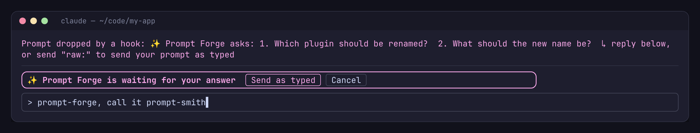
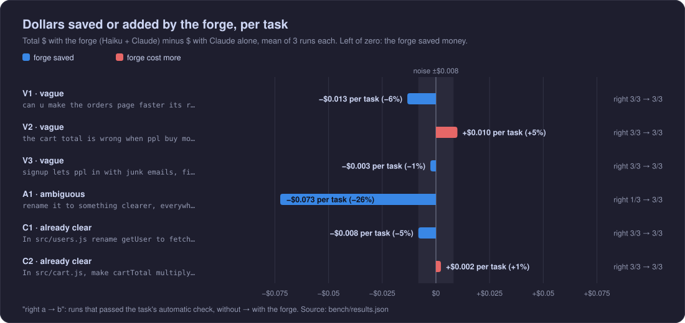
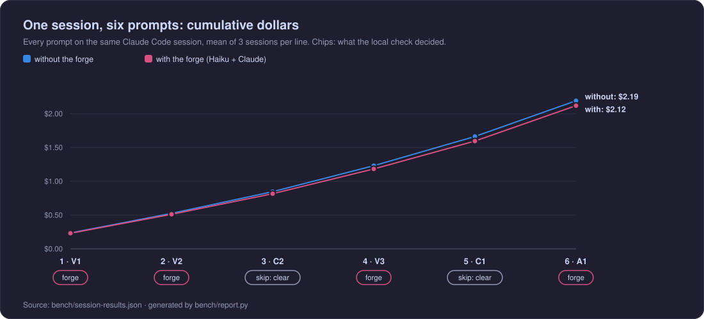

<div align="center">

<a href="assets/brag.mp4"></a>

<sub>▶ <a href="assets/brag.mp4">Watch with sound</a> (21 s)</sub>

# ✨ Prompt Forge

**Sharper prompts for [Claude Code](https://claude.com/claude-code), without retyping them.**
Type the way you think. Prompt Forge rewrites it into a clear, actionable prompt before Claude sees it, and shows you exactly what it changed.

[](.claude-plugin/marketplace.json)
[](https://claude.com/claude-code)
[](LICENSE)
[](#cost-and-privacy)
[](https://github.com/tomikng/prompt-forge/stargazers)

[Install](#install) · [See it](#see-it) · [How it works](#how-it-works) · [Benchmarks](#benchmarks) · [Commands](#commands) · [📖 Full guide](HELP.md)

</div>

---

## Why

Claude does its best work when a prompt states the goal, the limits and what "done" looks like. Most of us type something closer to *"can u make the dashboard faster its slow, dont touch the api"*. Prompt Forge closes that gap automatically:

- 🧱 **Your details, word for word.** File names, errors, numbers and constraints you typed are kept exactly.
- ➕ **Adds information, not work.** It names what you're referring to and spells out limits you buried, but never adds requirements, tests or finish lines. A rough prompt Claude already understands goes out as typed.
- 🚫 **No inventions.** It never adds files, APIs or requirements you didn't mention.
- 🧭 **Knows what "it" means.** The last few messages of the conversation are used to name what you're referring to.
- 🤫 **Asks only when it must.** It asks you only for what nobody else can know (a value you agreed on, a name you have in mind). Everything the agent can work out itself, it leaves to the agent.
- 💸 **Cuts spend on long sessions.** When a prompt starts an unrelated task in a long session, it offers to start fresh (`/clear`, then your prompt), so Claude stops re-reading the old conversation on every step: **−25% per session** in the benchmark. One keypress, and never on a follow-up.
- 🖼️ **Keeps your images.** A prompt with a pasted image or file goes out exactly as typed, attachment and all.
- 👀 **Nothing hidden.** Every rewrite shows up as a before/after card in the transcript.
- ✋ **Easy to bypass.** Start a prompt with `raw:` or run `/forge off`.

## See it


**Every rewritten prompt** appears in the transcript as a card: what you typed, what was sent, and what improved.


**When only you know the answer, it asks.** Your prompt is held, the questions appear in the transcript, and your answer is folded in before anything is sent:



**Prompts a rewrite wouldn't improve are left alone**, `raw:` sends a prompt untouched, and `/forge` turns it on and off:


<sub>The screenshots are faithful recreations of the plugin's terminal output (<code>scripts/mockups</code>, rendered by <code>scripts/render-assets.sh</code>). The card's layout and wording come straight from <code>hooks/register.tsx</code>.</sub>

## Install

Run these **one at a time** in Claude Code. Each is a separate command.

**1. Add the marketplace**

```text
/plugin marketplace add tomikng/prompt-forge
```

> [!TIP]
> If you open the **Add Marketplace** dialog from the `/plugin` menu instead, paste only `tomikng/prompt-forge` into the box.

**2. Install the plugin**

```text
/plugin install prompt-forge@prompt-forge
```

**3. Just type.** Your next prompt of five or more words gets forged. `/forge` shows whether it's on.

<details>
<summary>Prefer the shell?</summary>

```bash
claude plugin marketplace add tomikng/prompt-forge
claude plugin install prompt-forge@prompt-forge
```
</details>

> [!NOTE]
> Requires Claude Code **2.1.289+** (function-hook plugins, an early-access API).
> The card draws in the terminal and the desktop Code tab.

**Updates.** Auto-update is **off by default** for community marketplaces. To turn it on: `/plugin` → **Marketplaces** → `prompt-forge` → **Enable auto-update**. To update by hand:

```bash
claude plugin marketplace update prompt-forge
claude plugin update prompt-forge@prompt-forge
```

## How it works



<details>
<summary>The same flow as text</summary>

```text
you press Enter
   │
   ├─ slash command, "raw:", fewer than 5 words, or /forge off? ──▶ sent as typed
   ├─ already names a file/identifier AND a finish line? ──▶ sent as typed (local check, no tokens)
   │
   ▼
✨ Forging your prompt…            (status line, usually 1–2 s)
   │  one Haiku call: the rewrite rules, your prompt, the last few messages
   ▼
nothing to add? ──▶ "nothing to add, sent as typed"
   │
needs a fact only you know? ──▶ prompt held, questions shown in the transcript
   │                    │  you type an answer (any length) and press Enter
   │                    ▼
   │                 prompt + answer forged together ──┐
   ▼                                                    ▼
rewritten prompt is sent to Claude ──▶ before/after card, and the agent gets to work
```

</details>

| What happens | When |
| --- | --- |
| Rewritten | Prompts you typed with **5 or more words** |
| Skipped by the local check, no model call | Prompts that already name a target (a file, path, `code` or identifier) **and** a finish line (*run npm test*, *should*, *make sure*…), with no unresolved "it"/"that" |
| Sent as typed | Slash commands, short replies ("yes go ahead"), prompts with an image or file attached, prompts starting with `raw:`, and anything while `/forge off` |
| Left alone, with a notice | A rewrite would add nothing (most rough prompts Claude already understands), or it's not a task at all (a question to the agent like *"so this MR does nothing?"*) |
| Held, with a fresh-start offer | A new, unrelated task while the session re-reads 30k+ tokens of earlier conversation. Reply `f` to `/clear` and send it fresh, `h` to send it here; or use the buttons |
| Held, with questions | The work depends on something only you know (a value you agreed on, a name you have in mind). Your next message answers it; `raw:` alone, **Send as typed** or **Cancel** skip it |
| Sent as typed, with a notice | The Haiku call fails or takes longer than 15 s |

Only prompts **you type** are forged. Messages from other plugins, background tasks or other agents pass straight through.

### What a rewrite changes

The forge rewrites only to add information Claude wouldn't otherwise act on: what "it" means, from the conversation, or a limit you buried. Your words stay, and it never adds requirements, tests or finish lines you didn't ask for. A rough prompt that's already understandable goes out as typed:



### Context first, questions last

The forge reads the last few messages of the conversation to work out what "it" or "that" means. What it can't resolve, it leaves in your words for the agent, which has the whole conversation. Only what nobody but you can know becomes a question:



The exact rewrite rules are in the [📖 guide](HELP.md#the-rewrite-rules).

## Benchmarks

**In short:** with its fresh-start offer, Prompt Forge 0.5 **cut spend by 25%** over a six-prompt session ($1.64 vs $2.20), with **every step still right** (18/18). The rewriting alone (0.4.1) is break-even: +3%, inside run-to-run noise, with every task right and almost no questions. Its own Haiku calls cost **about $0.002 per prompt**. See [Starting fresh](#starting-fresh-050).

That's the result of three rounds of benchmarking, each one changing the rewrite rules (full story [below](#how-we-got-here)):

| Version | What the forge did | Times you step in, per session | Cost vs no forge, per session |
| --- | --- | --- | --- |
| 0.2 | Asked whenever it was unsure | 4 | about even (its questions pulled file names out of you) |
| 0.4.0 | Rarely asked, rewrote freely | 0–1 | **+17%**: rewrites added scope, so Claude did more work |
| 0.4.1 | Rarely asks, rewrites only to add information | 0–1 | +3% (noise) |
| **0.5.0** | **0.4.1, plus a fresh-start offer for new tasks in long sessions** | **0, plus ~1 keypress for a fresh start** | **−25%** |



Six coding tasks on a small Node project, each run 3 times **without** the forge (prompt as typed → Claude) and 3 times **with** it (prompt → Haiku forge → Claude), all on the same day. Every run was checked automatically: tests pass, the behaviour asked for works, and the protected API file is untouched.

| Task | What it says | $ without | $ with | Correct runs | What the forge did |
| --- | --- | --- | --- | --- | --- |
| V1 · vague | *"can u make the orders page faster its really slow, dont touch the api"* | $0.228 | $0.217 | 3/3 → 3/3 | left it alone |
| V2 · vague | *"the cart total is wrong when ppl buy more than one of something fix it"* | $0.191 | $0.188 | 3/3 → 3/3 | left it alone |
| V3 · vague | *"signup lets ppl in with junk emails, fix that"* | $0.217 | $0.220 | 3/3 → 3/3 | left it alone |
| A1 · ambiguous | *"rename it to something clearer, everywhere it's used"*, cold start | $0.376 | $0.479 | **2/3 → 3/3** | left it alone (see below) |
| C1 · clear | names the file, the change and *run npm test* | $0.169 | $0.170 | 3/3 → 3/3 | left it alone |
| C2 · clear | names the file, the change and the test to add | $0.175 | $0.175 | 3/3 → 3/3 | left it alone |

- **Rough prompts are fine as they are.** Claude Opus found the right code and fixed it from V1–V3 as typed. 0.4.1 doesn't rewrite them, so nothing changes and you pay only the Haiku call. 0.4.0 polished them and added requirements nobody asked for (*"…reject disposable-email domains, with a clear error"*), which made Claude do 8–15% more work for the same result.
- **A1 is about who asks, not about the forge.** At a cold start, "it" and the new name can't be known. The forge sent the prompt unchanged, so Claude saw exactly what it sees without the forge. In all 3 runs it stopped to ask you and then got it right; without the forge it asked twice and guessed wrong once. The extra $0.10 is that second round trip, not the forge.
- **Run-to-run noise** is about ±$0.01 per task (V1–V3 and C1–C2 sent the identical prompt in both arms): treat smaller differences as zero.

### Over a whole session

Real work is a string of prompts on one session. The same six prompts ran **in order on one Claude Code session** (V1 → V2 → C2 → V3 → C1 → A1), 3 sessions with the forge and 3 without. Context grows with every step, and in the forge sessions Haiku also gets the recent conversation, as the plugin does.



| Per session | Mean | Range (3 sessions) | Steps done right | Times you step in |
| --- | --- | --- | --- | --- |
| Without the forge | **$2.20** | $2.13–$2.25 | 18/18 | 0 |
| With the forge 0.4.1 | **$2.27** | $2.13–$2.35 | 18/18 | 1 (in 18 steps) |

- **💵 Break-even.** +$0.07 per session (+3%), inside the spread of the sessions themselves.
- **🧮 The forge is a rounding error.** All its Haiku calls came to about **$0.011 per session**. The big cost is Claude re-reading a growing conversation: about $0.23 at step 1, $0.55 by step 6, in both arms.
- **🎯 The local check made the right call 6/6 times, in about 1 µs, with zero tokens.** It skipped C2 and C1, which name a file and a finish line, and sent the other four to the forge.
- **🔁 In a session, "it" resolves itself.** Right after C1 renamed `getUser` to `fetchUser`, A1 (*"rename it to something clearer"*) was clear from context: the forge named `fetchUser` in its rewrite, and Claude got it right in all 3 sessions.

### Starting fresh (0.5.0)

Rewording a prompt can't save much: in the sessions above, **99% of the money is Claude re-reading the conversation** on every step, $0.23 at step 1 and $0.55 by step 6. The one lever that moves that number is a smaller conversation. So when a prompt starts an unrelated task in a long session, Prompt Forge holds it and offers to start fresh:

```text
● Prompt dropped by a hook: ✨ Prompt Forge: this looks like a new task, and every step here
  re-reads 85k tokens of old conversation.  ↳ reply "f" to /clear and send it fresh, or "h" to send it here
╭─────────────────────────────────────────────────────────────────────────────────────────╮
│ ✨ New task? 85k tokens of old conversation ride along [ Start fresh & send ] [ Send here ] │
╰─────────────────────────────────────────────────────────────────────────────────────────╯
```

- **One tiny Haiku call decides** whether the prompt continues the conversation or starts something new, and it answers "continues" when unsure: anything that says "it", "that", "again" or names something from the conversation stays.
- **Only in long sessions.** It counts only the conversation, not the system prompt and tools every request carries (27k tokens on a bare install, more with plugins), and asks only above 30k tokens of it.
- **`f`** runs `/clear` and sends your prompt into the fresh conversation; **`h`** sends it where you are. `/forge fresh off` turns the offer off.

The same six-prompt session, with the fresh-start offer accepted every time it was made:

| Per session | Mean | Range (3 sessions) | Steps done right | Fresh starts |
| --- | --- | --- | --- | --- |
| Without the forge | $2.20 | $2.13–$2.25 | 18/18 | – |
| With the forge 0.4.1 | $2.27 | $2.13–$2.35 | 18/18 | – |
| **With the forge 0.5, fresh starts accepted** | **$1.64** | **$1.48–$1.76** | **18/18** | 4 in 3 sessions |

- **💸 −25% per session.** After a fresh start, steps 5 and 6 cost **$0.15 and $0.24** instead of $0.44 and $0.55.
- **🎯 No harmful clears.** It started fresh before the signup task (V3) once and before the users rename (C1) in every session, both self-contained. It never started fresh before A1 (*"rename it to something clearer"*), which needs the rename just before it, and A1 stayed right in all 3 sessions.
- **🧮 The check is nearly free:** about $0.006 per session.
- **Caveats:** each fresh start is one keypress from you. The benchmark offered it on every topic change; the plugin also requires 30k+ tokens of conversation, which every one of these steps had. In your own work, a fresh start is only as good as the new task's independence: if it needs something from earlier, answer `h`.

### Asking less

Haiku asks **only for what nobody but you can know** (a value you agreed on, a name you have in mind) and leaves everything else, in your own words, for the agent, which has the whole conversation. Questions to the agent (*"so this MR does nothing?"*) go through untouched, and so do prompts with an image or file attached: Haiku can't see those.

**Routing** (Haiku only, 15 prompts × 3 runs, each labelled with whether a question is really needed; [`bench/policy.py`](bench/policy.py)):

| Rules | Needless questions, no context | Needless questions, with conversation | Missed a question it needed | Rewritten, no context / with conversation |
| --- | --- | --- | --- | --- |
| 0.3 (ask when unsure) | 23/33 | 13/33 | 3/24 | 10/45 · 20/45 |
| 0.4.0 (ask less, rewrite freely) | 6/33 | 3/33 | 0/24 | 20/45 · 24/45, at 3–4.5× length |
| **0.4.1 (ask less, add only information)** | **1/33** | **2/33** | **0/24** | **3/45 · 20/45, at 1–1.9× length** |

### How we got here

- **0.2** asked questions on every vague prompt, four interruptions per six-prompt session, even when the conversation had the answer. It broke even on cost, because your answers named the exact file (*"`ordersPageRows` in `src/orders.js`"*) and saved Claude a search.
- **0.4.0** stopped asking for what the agent can find itself: interruptions went to almost zero. But with no answers to fold in, it "improved" prompts anyway, adding scope, and a same-day benchmark showed **+17% per session**.
- **0.4.1** rewrites only when it adds information the agent would not otherwise act on: a reference resolved from the conversation, a buried limit, a rambling prompt untangled. Otherwise it sends the prompt as typed. Cost went back to break-even, with the interruptions still gone.

The V3 check was fixed along the way: it required `ann@example.com` to be accepted, but `example.com` is a reserved domain that can't receive mail, and rejecting it as junk is a fair call. It now requires a real-looking address (`ann@gmail.com`) and only notes the `example.com` decision.

<details>
<summary>Method, caveats and how to reproduce</summary>

- **Models:** Claude Code with Claude Opus 5.5 does the work; Claude Haiku 4.5 runs the forge. Dollar amounts come from Claude Code's own cost accounting (`claude -p --output-format json`), at list prices.
- **Forge cost is an upper bound.** Forge calls ran through `claude -p --model haiku` with the forge's exact system prompt and message shape, with skills, MCP servers and settings switched off. The CLI's identity block (~335 tokens) is still counted, so the real plugin call costs the same or less.
- **Replies:** if Claude ended a run by asking a question instead of working, the task's canned answer was sent on the same session, in both arms, and both calls were counted. The same canned answer was used to answer the forge's questions.
- **Scope:** a small fixture project (`bench/fixture`: 8 source files, 4 test files), 6 tasks, 3 runs each with and without the forge, plus 3 six-step sessions each, all run on 2026-10-09. Earlier rounds are kept: `bench/*-0.2.json` (0.2) and `bench/*-0.4.0.json` (0.4.0).
- **Sessions:** each step's check runs on the working tree right after that step. In the session, A1's target is `fetchUser` (renamed by C1), and the canned answer names it. The local check is the plugin's own `hooks/classify.ts`, run by Node. In a large codebase, a vague prompt can cost more file searching, which these numbers don't capture. Your results will differ.
- **Every number** is in [`bench/RESULTS.md`](bench/RESULTS.md), generated from the raw [`bench/results.json`](bench/results.json).

```bash
python3 bench/bench.py run --reps 3     # the benchmark (~$7 at Opus prices)
python3 bench/bench.py strategies       # forge cost per prompt type (< $0.05)
python3 bench/session.py run --reps 3   # the session benchmark (~$13 at Opus prices)
python3 bench/bench.py report           # RESULTS.md and assets/bench-net.svg
python3 bench/policy.py routing --reps 3                                        # ask-policy routing (Haiku only, cents)
python3 bench/bench.py run --reps 3 --arms forge-ask,forge-minimal --out results-policy.json  # policies end to end
python3 bench/session.py run --reps 3 --arms forge-minimal --out session-final.json
python3 bench/session.py run --reps 3 --arms guard-lean --out session-guard.json   # fresh-start offer, always accepted
```
</details>

## Commands

| Command | What it does |
| --- | --- |
| `/forge` | Show whether Prompt Forge is on |
| `/forge off` | Send every prompt exactly as typed (remembered across sessions) |
| `/forge on` | Turn rewriting back on |
| `raw: <prompt>` | Send this one prompt untouched; the `raw:` prefix is removed (also drops a held prompt) |
| `raw:` alone | While a prompt is held: send it as typed |
| `f` / `h` | While a new task is held: start fresh (`/clear`, then send it) / send it here |
| `/forge fresh off` | Never offer a fresh start (`/forge fresh on` turns it back on) |
| **Send as typed** / **Cancel** | On the question box: send the held prompt unchanged, or drop it |
| **ctrl+o** | Expand the transcript to see the plain sent text without the card |

## Cost and privacy

- **One small Haiku call per forged prompt** (two in the rare case it asks you something, plus a tiny new-task check in long sessions), made through your own Claude Code session and billed like the rest of your usage: **under $0.003 per prompt** in the [benchmarks](#benchmarks). Short replies and commands cost nothing.
- **What Haiku sees:** the rewrite rules (or, in a long session, the new-task check), your prompt, and the text of the last few messages (at most 6 messages and about 3,000 characters), so it can resolve "it" and "that". No files, tool output or attachments: a prompt with an attachment isn't sent to Haiku at all.
- **Nothing leaves your machine any other way.** No telemetry, no third-party services.
- The on/off switch is stored in the plugin's own store under `~/.claude/plugins/store/`. Before/after pairs for the cards live in session memory (the last 50) and are never written to disk by the plugin.

## FAQ

**Can it change what I meant?** It's instructed to keep every detail word for word and invent nothing, and the card always shows both versions. If a rewrite misses, resend with `raw:` and [report it](https://github.com/tomikng/prompt-forge/issues/new?template=bad-rewrite.yml).

**How much of my conversation does it see?** Only the text of the last few messages, capped at about 3,000 characters, never files or tool output. It uses them to name what you're pointing at, never to add requirements. When that isn't enough, it asks you instead of guessing.

**Does it slow me down?** A rewrite usually adds 1–2 seconds before Claude starts. `/forge off` removes that entirely.

**Why does an old prompt show without the card after a restart?** Cards are drawn from session memory, so resumed sessions show the sent text only.

## Development

```bash
claude --plugin-dir ./plugins/prompt-forge      # run it from source
claude plugin validate ./plugins/prompt-forge   # check the manifest and hooks
claude plugin test ./plugins/prompt-forge       # run the tests
./scripts/render-assets.sh                      # regenerate README screenshots (chromium + ImageMagick)
python3 scripts/diagrams.py                     # regenerate the animated diagrams
python3 bench/bench.py report                   # rebuild benchmark tables and chart
```

```text
plugins/prompt-forge/
├── hooks/register.tsx   # prompt rewrite, questions band, /forge command, transcript card
├── types/index.d.ts     # state contract
└── tests/forge.test.ts
```

Issues and PRs are welcome, especially examples of rewrites that went wrong.

## License

[MIT](LICENSE) © tomikng
