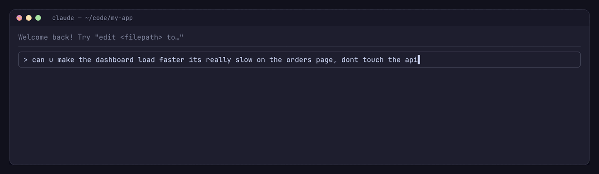
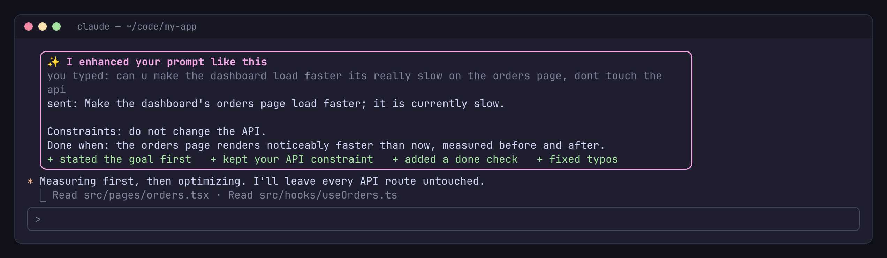
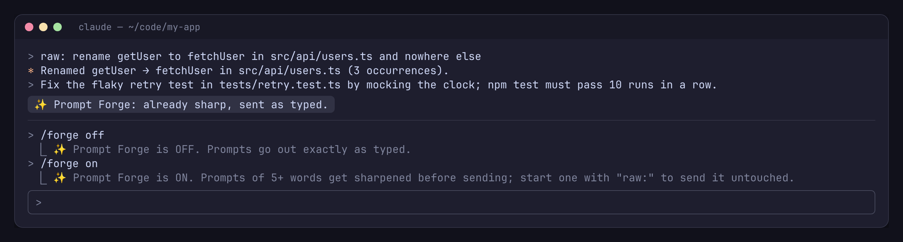

<div align="center">



# ✨ Prompt Forge

**Sharper prompts for [Claude Code](https://claude.com/claude-code), without retyping them.**
Type the way you think. Prompt Forge rewrites it into a clear, actionable prompt before Claude sees it, and shows you exactly what it changed.

[](.claude-plugin/marketplace.json)
[](https://claude.com/claude-code)
[](LICENSE)
[](#cost-and-privacy)
[](https://github.com/tomikng/prompt-forge/stargazers)

[Install](#install) · [See it](#see-it) · [How it works](#how-it-works) · [Commands](#commands) · [📖 Full guide](HELP.md)

</div>

---

## Why

Claude does its best work when a prompt states the goal, the limits and what "done" looks like. Most of us type something closer to *"can u make the dashboard faster its slow, dont touch the api"*. Prompt Forge closes that gap automatically:

- 🎯 **Goal first.** The rewrite leads with what you actually want.
- 🧱 **Your details, word for word.** File names, errors, numbers and constraints you typed are kept exactly.
- ✅ **A finish line.** A "done when" check is added when your prompt implies one.
- 🚫 **No inventions.** It never adds files, APIs or requirements you didn't mention.
- 👀 **Nothing hidden.** Every rewrite shows up as a before/after card in the transcript.
- ✋ **Easy to bypass.** Start a prompt with `raw:` or run `/forge off`.

## See it

**Every rewritten prompt** appears in the transcript as a card: what you typed, what was sent, and what improved.



**Already clear prompts are left alone**, `raw:` sends a prompt untouched, and `/forge` turns it on and off:



<sub>The screenshots are faithful recreations of the plugin's terminal output (<code>scripts/mockups</code>, rendered by <code>scripts/render-assets.sh</code>). The card's layout and wording come straight from <code>hooks/register.tsx</code>.</sub>

## Install

Run these **one at a time** in Claude Code. Each is a separate command.

**1. Add the marketplace**

```text
/plugin marketplace add tomikng/prompt-forge
```

> [!TIP]
> If you open the **Add Marketplace** dialog from the `/plugin` menu instead, paste only `tomikng/prompt-forge` into the box.

**2. Install the plugin**

```text
/plugin install prompt-forge@prompt-forge
```

**3. Just type.** Your next prompt of five or more words gets forged. `/forge` shows whether it's on.

<details>
<summary>Prefer the shell?</summary>

```bash
claude plugin marketplace add tomikng/prompt-forge
claude plugin install prompt-forge@prompt-forge
```
</details>

> [!NOTE]
> Requires Claude Code **2.1.289+** (function-hook plugins, an early-access API).
> The card draws in the terminal and the desktop Code tab.

**Updates.** Auto-update is **off by default** for community marketplaces. To turn it on: `/plugin` → **Marketplaces** → `prompt-forge` → **Enable auto-update**. To update by hand:

```bash
claude plugin marketplace update prompt-forge
claude plugin update prompt-forge@prompt-forge
```

## How it works

```text
you press Enter
   │
   ├─ slash command, "raw:", fewer than 5 words, or /forge off? ──▶ sent as typed
   │
   ▼
✨ Forging your prompt…            (status line, usually 1–2 s)
   │  one Haiku call: your prompt + the rewrite rules, nothing else
   ▼
already clear? ──▶ "already sharp, sent as typed"
   │
   ▼
rewritten prompt is sent to Claude ──▶ before/after card in the transcript
```

| What happens | When |
| --- | --- |
| Rewritten | Prompts you typed with **5 or more words** |
| Sent as typed | Slash commands, short replies ("yes go ahead"), prompts starting with `raw:`, and anything while `/forge off` |
| Left alone, with a notice | Haiku judges the prompt already clear and specific |
| Sent as typed, with a notice | The Haiku call fails or takes longer than 15 s |

Only prompts **you type** are forged. Messages from other plugins, background tasks or other agents pass straight through.

The exact rewrite rules are in the [📖 guide](HELP.md#the-rewrite-rules).

## Commands

| Command | What it does |
| --- | --- |
| `/forge` | Show whether Prompt Forge is on |
| `/forge off` | Send every prompt exactly as typed (remembered across sessions) |
| `/forge on` | Turn rewriting back on |
| `raw: <prompt>` | Send this one prompt untouched; the `raw:` prefix is removed |
| **ctrl+o** | Expand the transcript to see the plain sent text without the card |

## Cost and privacy

- **One small Haiku call per rewritten prompt**, made through your own Claude Code session, so it's billed like the rest of your usage. The rules plus a typical prompt come to a few hundred tokens. Short replies and commands cost nothing.
- **Only the prompt text is sent to Haiku**: no files, conversation history or project context.
- **Nothing leaves your machine any other way.** No telemetry, no third-party services.
- The on/off switch is stored in the plugin's own store under `~/.claude/plugins/store/`. Before/after pairs for the cards live in session memory (the last 50) and are never written to disk by the plugin.

## FAQ

**Can it change what I meant?** It's instructed to keep every detail word for word and invent nothing, and the card always shows both versions. If a rewrite misses, resend with `raw:` and [report it](https://github.com/tomikng/prompt-forge/issues/new?template=bad-rewrite.yml).

**Why doesn't Haiku see my conversation?** Keeping the call to the prompt alone makes it fast, cheap and private. It also means the forge can't fill in specifics. It restructures what you said and doesn't guess.

**Does it slow me down?** A rewrite usually adds 1–2 seconds before Claude starts. `/forge off` removes that entirely.

**Why does an old prompt show without the card after a restart?** Cards are drawn from session memory, so resumed sessions show the sent text only.

## Development

```bash
claude --plugin-dir ./plugins/prompt-forge      # run it from source
claude plugin validate ./plugins/prompt-forge   # check the manifest and hooks
claude plugin test ./plugins/prompt-forge       # run the tests
./scripts/render-assets.sh                      # regenerate README images (chromium + ImageMagick)
```

```text
plugins/prompt-forge/
├── hooks/register.tsx   # prompt rewrite, /forge command, transcript card
├── types/index.d.ts     # state contract
└── tests/forge.test.ts
```

Issues and PRs are welcome, especially examples of rewrites that went wrong.

## License

[MIT](LICENSE) © tomikng
