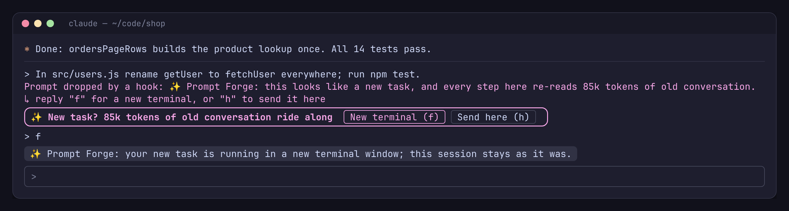

<div align="center">

<a href="assets/brag.mp4"></a>

<sub>▶ <a href="assets/brag.mp4">Watch the video</a> (21 s)</sub>

# ✨ Prompt Forge

**Spend your [Claude Code](https://claude.com/claude-code) tokens where they count.**
Most of what a session costs is Claude re-reading the conversation. Prompt Forge moves a new task into a fresh session (a new terminal window, or a git worktree of its own) instead of dragging a long conversation along, and runs small, clear tasks on Sonnet: **−41% per session** in [its benchmark](#benchmarks), every step still right.

[](.claude-plugin/marketplace.json)
[](https://claude.com/claude-code)
[](LICENSE)
[](#benchmarks)
[](https://github.com/tomikng/prompt-forge/stargazers)

[Install](#install) · [See it](#see-it) · [How it works](#how-it-works) · [Benchmarks](#benchmarks) · [Commands](#commands) · [📖 Full guide](HELP.md)

</div>

---

## Why

In a long Claude Code session, every prompt makes Claude re-read everything said so far. In the benchmark session, the cost per prompt climbed from $0.23 to $0.55 as the conversation grew, mostly from re-reading it. Prompt Forge spends your tokens where they count:

- 💸 **A fresh session for new tasks.** When a prompt starts something new in a long session, it offers to run it in a new terminal window instead (`f`). Your current session stays exactly as it was. One keypress, never on a follow-up.
- 🧭 **The right place for the work.** A new task on the same feature runs in a new terminal in the same folder. An unrelated one can get its own git worktree and branch (`w`), so it doesn't land in this branch's diff.
- 🖥️ **Works where you work.** tmux, any Linux desktop terminal, macOS Terminal and Windows Terminal; inside Superset it opens Superset terminals and workspaces instead. Nowhere to open one? It falls back to `/clear`.
- ⚡ **Sonnet for small, clear tasks.** A prompt that names its file and its finish line, on a fresh context, runs that one turn on Claude Sonnet at about half the price. Your next prompt goes back to your model.
- ✍️ **Your prompts, untouched.** Everything goes out exactly as you typed it, instantly. Haiku only runs one tiny check, and only in long sessions.
- 🎯 **Measured, not guessed.** −41% per six-prompt session, every step still right, against a same-day baseline. The [benchmarks](#benchmarks) and their [caveats](#before-you-count-on-the-41) are below.
- 🖼️ **Keeps your images.** A prompt with a pasted image or file is never held.
- ✋ **Easy to bypass.** Answer `h`, start a prompt with `raw:`, or run `/forge off`.

## See it

**A new task in a long session:** Prompt Forge holds it and offers a fresh session. `f` starts Claude with your prompt in a new terminal window; `h` sends it here. This session stays as it was. Since the task is small and clear, the new session's first turn runs on Sonnet:



<sub>A faithful recreation of the plugin's terminal output (<code>scripts/mockups</code>, rendered by <code>scripts/render-assets.sh</code>); the wording comes straight from <code>hooks/register.tsx</code>.</sub>

## Install

Run these **one at a time** in Claude Code. Each is a separate command.

**1. Add the marketplace**

```text
/plugin marketplace add tomikng/prompt-forge
```

> [!TIP]
> If you open the **Add Marketplace** dialog from the `/plugin` menu instead, paste only `tomikng/prompt-forge` into the box.

**2. Install the plugin**

```text
/plugin install prompt-forge@prompt-forge
```

**3. Just work.** Nothing changes until it can save you something. `/forge` shows what's on.

<details>
<summary>Prefer the shell?</summary>

```bash
claude plugin marketplace add tomikng/prompt-forge
claude plugin install prompt-forge@prompt-forge
```
</details>

> [!NOTE]
> Requires Claude Code **2.1.289+** (function-hook plugins, an early-access API).
> The fresh-start offer draws in the terminal and the desktop Code tab.

**Updates.** Auto-update is **off by default** for community marketplaces. To turn it on: `/plugin` → **Marketplaces** → `prompt-forge` → **Enable auto-update**. To update by hand:

```bash
claude plugin marketplace update prompt-forge
claude plugin update prompt-forge@prompt-forge
```

## How it works



| What happens | When |
| --- | --- |
| Held, with a fresh-session offer | A new task while the session re-reads 30k+ tokens of earlier conversation. `f` starts it in a new terminal, `w` (unrelated work, in a git repository) on a new worktree of its own, `h` sends it here; or use the buttons |
| Run on Sonnet | A clear prompt (it names a file, path, `code` or identifier **and** a finish line like *run npm test*, *should*, *make sure*) while the conversation is at most 10k tokens |
| Sent as typed | Everything else: follow-ups, short sessions, short replies, slash commands, prompts with an image or file, `raw:` prompts, and anything while `/forge off` |

- **New task or follow-up?** One tiny Haiku call reads the last few messages and your prompt. Anything that says "it", "that", "again" or names something from the conversation is a follow-up, and when unsure it answers follow-up: starting fresh by mistake would lose context you need.
- **Where the new session opens.** Prompt Forge uses the first that works:
  1. **tmux:** if you're in tmux, a new window running `claude "<your prompt>"` in the same folder.
  2. **A terminal window:** your default terminal on Linux (`xdg-terminal-exec`), Terminal on macOS, or Windows Terminal, in the same folder.
  3. **`/clear` here**, then your prompt, if neither is available. `/forge fresh clear` makes `/clear` the first choice.
- **Its own branch, for unrelated work.** `w` adds a git worktree next to your repository (`<repo>-<task-name>`) on a new branch from your default branch, and opens the new session there.
- **In Superset:** if the session runs in a Superset workspace, `f` opens a new Claude terminal in that workspace (`superset agents create`) and `w` a new Superset workspace (`superset ws create`), which is how Superset handles worktrees.
- **Related or unrelated?** The same Haiku check also sees the current git branch: a new task on the same feature, ticket or branch is *related* (new terminal), anything else *unrelated* (`w` offered). When unsure it says related.
- **Only the conversation counts.** Every request also carries the system prompt, tools and MCP servers (27k tokens on a bare install, often far more with plugins), which `/clear` can't remove. Prompt Forge takes the smallest context it has seen as that fixed part and counts only what's above it.
- **Sonnet only on a small context.** The prompt cache is per model: switching a long conversation would make Sonnet re-read all of it uncached, which costs more than staying on Opus. So routing waits for a new session: the one Prompt Forge opens for your task leaves itself a note to run that first turn on Sonnet.
- **Only prompts you type** are checked. Messages from other plugins, background tasks or other agents pass straight through.

## Benchmarks

**In short:** over a six-prompt session, Prompt Forge **cut spend by 41%** ($1.29 vs $2.20), with **every step still right** (18/18). Fresh starts alone gave −25%; Sonnet for small, clear tasks halved those tasks on top. Its own Haiku calls came to about **$0.007 per session**.

Six coding tasks on a small Node project ran **in order on one Claude Code session** (V1 → V2 → C2 → V3 → C1 → A1), 3 sessions with Prompt Forge and 3 without, all on the same day. Every step was checked automatically: tests pass, the behaviour asked for works, a protected API file is untouched. Every fresh start Prompt Forge offered was accepted.


| Per session | Mean | Range (3 sessions) | Steps done right | Fresh starts / Sonnet turns |
| --- | --- | --- | --- | --- |
| Without Prompt Forge | $2.20 | $2.13–$2.25 | 18/18 | – |
| Fresh starts only (0.5, prompts still rewritten) | $1.64 | $1.48–$1.76 | 18/18 | 4 / – |
| **Fresh starts + Sonnet (0.8+)** | **$1.29** | **$1.11–$1.47** | **18/18** | **6 / 3** |

| Step | Task | Without | With | What Prompt Forge did |
| --- | --- | --- | --- | --- |
| 1 | V1 · *"can u make the orders page faster…, dont touch the api"* | $0.23 | $0.24 | nothing: first prompt |
| 2 | V2 · *"the cart total is wrong when ppl buy more than one…"* | $0.28 | $0.25 | fresh start in 1 of 3 sessions |
| 3 | C2 · cart fix, file and test named | $0.32 | $0.28 | nothing: same topic |
| 4 | V3 · *"signup lets ppl in with junk emails, fix that"* | $0.38 | $0.27 | fresh start in 2 of 3 sessions |
| 5 | C1 · *"In src/users.js rename getUser to fetchUser…; run npm test"* | $0.44 | **$0.09** | fresh start, then Sonnet, in every session |
| 6 | A1 · *"rename it to something clearer, everywhere it's used"* | $0.55 | **$0.15** | nothing: a follow-up, on a small conversation |

- **💸 The saving is the conversation not riding along.** After the fresh start before C1, the users rename ran on Sonnet for $0.09 and the follow-up rename cost $0.15, against $0.44 and $0.55 without Prompt Forge.
- **🎯 No harmful clears.** It never started fresh before A1, which says "it" and needs the rename just before it, and A1 was right in every session.
- **⚡ Sonnet held up.** As single tasks on a fresh context, C1 and C2 cost $0.087 and $0.099 on Sonnet against $0.169 and $0.175 on Opus, every run right; in the sessions, every Sonnet turn was right too.
- **🧮 The checks are a rounding error:** about $0.007 of Haiku per session.

### Before you count on the −41%

- **Small test, small project.** Three sessions of six prompts on a 12-file project. On a large codebase Sonnet may need more turns for the same task, so the saving can shrink.
- **The saving comes from you pressing `f`.** The benchmark accepted every fresh-start offer. If you usually answer `h`, you'll save little.
- **The new-task check isn't fully consistent.** It offered a fresh start before the cart task (V2) in only 1 of 3 sessions, and before the signup task (V3) in 2 of 3. On your own work, answer `h` whenever the new task needs earlier context.
- **Same-day comparisons.** Every dollar figure is against a no-Prompt-Forge baseline run the same day (2026-10-09).

### How we got here

Prompt Forge started as a prompt rewriter: Haiku sharpened each prompt before Claude saw it. Same-day benchmarks showed the rewriting never saved money. Asking you questions (0.2) broke even but interrupted four times a session; rewriting freely (0.4.0) cost **+17%**, because it added work nobody asked for; rewriting only to add information (0.4.1) broke even. With fresh starts and Sonnet in place, turning rewriting off changed nothing measurable ($1.24 with it, $1.29 without, ranges overlapping) except removing a 1–2 second delay from every prompt. So 0.8 removed it. The old data and rules are kept in `bench/` (`*-0.2.json` … `*-0.6.0.json`, `bench/policies/`).

<details>
<summary>Method and how to reproduce</summary>

- **Models:** Claude Code with Claude Opus 5.5 does the work; Claude Haiku 4.5 runs the new-task check; Claude Sonnet 5.5 runs the routed turns. Dollar amounts come from Claude Code's own cost accounting (`claude -p --output-format json`), at list prices.
- **Sessions:** each step ran with `claude -p --resume` on the same session; a fresh start began a new session, as `f` does (a new terminal and `/clear` start from the same empty conversation, so they cost the same); a Sonnet turn ran with `--model sonnet`. Each step's check runs on the working tree right after that step. If Claude stopped to ask instead of working, the task's canned answer was sent, and both calls were counted. The local check is the plugin's own `hooks/classify.ts`, run by Node.
- **Every number** is in [`bench/session-results.json`](bench/session-results.json) (this run), [`bench/results-route.json`](bench/results-route.json) (Sonnet single tasks) and [`bench/RESULTS.md`](bench/RESULTS.md). RESULTS.md's per-task section is from 0.6, when prompts were still rewritten.

```bash
python3 bench/session.py run --reps 3 --arms baseline --out session-baseline.json      # without Prompt Forge
python3 bench/session.py run --reps 3 --arms guardroute-none --out session-results.json # fresh starts + Sonnet
python3 bench/session.py run --reps 3 --arms guard-none --out session-guard.json        # fresh sessions only
python3 bench/bench.py run --reps 3 --only C1,C2 --arms route-none --out results-route.json  # Sonnet single tasks
python3 bench/bench.py report                                                          # RESULTS.md and the charts
```
</details>

## Commands

| Command | What it does |
| --- | --- |
| `f` / `w` / `h` | While a new task is held: start it in a new terminal / on a new git worktree and branch (unrelated work) / send it here |
| `/forge fresh clear` | Start new tasks with `/clear` here instead of a new session (`/forge fresh new` switches back) |
| `/forge` | Show what's on |
| `/forge fresh off` | Never offer a fresh session (`/forge fresh on` turns it back on) |
| `/forge model off` | Never switch a turn to Sonnet (`/forge model on` turns it back on) |
| `/forge off` | Turn Prompt Forge off: every prompt goes out as typed, on your model (`/forge on` turns it back on) |
| `raw: <prompt>` | Send this one prompt with no checks; the `raw:` prefix is removed |

## Cost and privacy

- **Haiku runs only in long sessions:** one tiny new-task check per prompt once the conversation passes 30k tokens, about $0.001–0.002 each (≈ $0.007 per benchmark session). Short sessions, short replies and commands cost nothing. Calls go through your own Claude Code session and are billed like the rest of your usage.
- **Sonnet turns** are billed at Sonnet's price, like any `/model sonnet` turn.
- **What Haiku sees:** the new-task check, your prompt, and the text of the last few messages (at most 6 messages and about 3,000 characters). No files, tool output or attachments.
- **Nothing leaves your machine any other way.** No telemetry, no third-party services. The switches are stored in the plugin's own store under `~/.claude/plugins/store/`.

## FAQ

**Does it change my prompts?** No. They go out exactly as typed. Earlier versions rewrote prompts; the benchmarks showed it never saved money, so 0.8 removed it.

**Does it slow me down?** Not in short sessions. In a long session the new-task check adds about a second before the prompt is sent.

**What if a fresh session was the wrong call?** Answer `h` and the prompt is sent where you are, nothing lost. And when it opens a new session, this one stays exactly as it was, so you can always go back. The check leans towards "follow-up" when unsure, and `/forge fresh off` turns the offer off for good.

**Is Sonnet as good as Opus for those tasks?** On the benchmark's clear tasks, yes: every run passed its checks. It's only used when the prompt names its file and its finish line, and only on a small context. `/forge model off` keeps every turn on your model.

## Development

```bash
claude --plugin-dir ./plugins/prompt-forge      # run it from source
claude plugin validate ./plugins/prompt-forge   # check the manifest and hooks
claude plugin test ./plugins/prompt-forge       # run the tests
./scripts/render-assets.sh                      # regenerate the screenshot (chromium + ImageMagick)
python3 scripts/diagrams.py                     # regenerate the animated diagram
python3 bench/bench.py report                   # rebuild benchmark tables and charts
```

```text
plugins/prompt-forge/
├── hooks/register.tsx   # new-task check, new sessions (tmux, terminal windows, worktrees, Superset, /clear), Sonnet routing, /forge
├── hooks/classify.ts    # the local "clear prompt" check
├── types/index.d.ts     # state contract
└── tests/forge.test.ts
```

Issues and PRs are welcome, especially fresh-start offers that came at the wrong moment.

## License

[MIT](LICENSE) © tomikng
